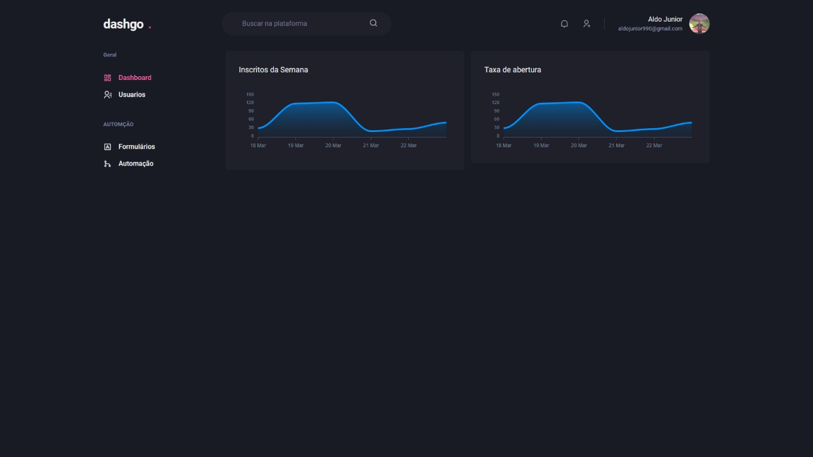
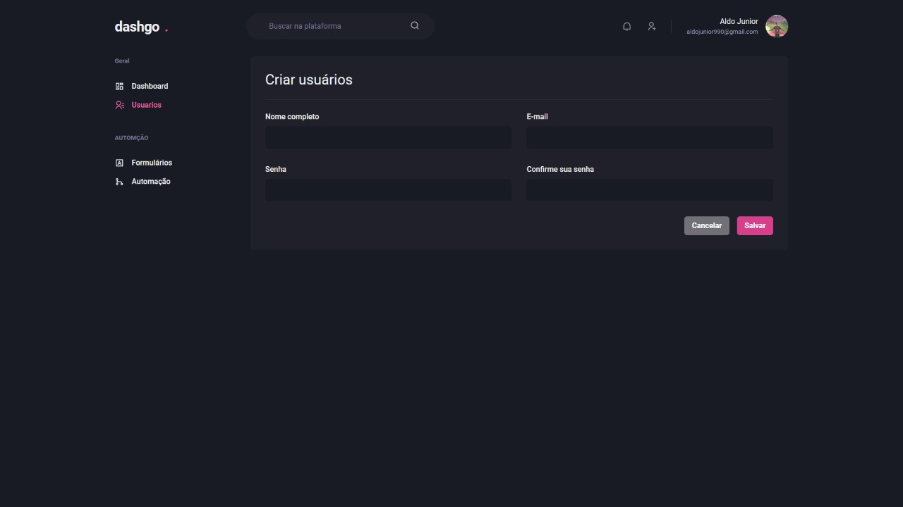

<h1 align="center">
  <strong>DashGo</strong>
</h1>
<br>

## Sobre o projeto - About the project

Esta é uma interface de Dashboard construida durante o curso Ignite da Rocketseat. A aplicação foi inteiramente desenvolvida com a biblioteca ChakraUi do React

This is a Dashboard interface built during Rocketseat's Ignite course. The application was fully developed with the ChakraUi library from React

<h1 align="center" display="flex">
   
</h1>
<h1 align="center" display="flex">
   
</h1>

## :computer: Tecnologias - Technologies

Este projeto foi desenvolvido com as seguintes tecnologias:
<br>
This project was developed with the following technologies:

- [Next](https://nextjs.org/)
- [TypeScript](https://www.typescriptlang.org/)
- [ChakraUI](https://chakra-ui.com/)
- [React-hook-form](https://react-hook-form.com/)
- [Yup](https://www.npmjs.com/package/yup)
  <br>

## Como executar - How to execute

Para iniciá-lo, siga as etapas abaixo:
<br>
To start it, follow the steps below:

```bash
# Instale as dependencias
# Install dependencies
$ yarn

# Inicie o projeto
# start the project
$ yarn dev
```

O aplicativo estará disponível em seu navegador no endereço http://localhost:3000.
<br>
The app will be available in your browser at the address http://localhost:3000.
<br>
